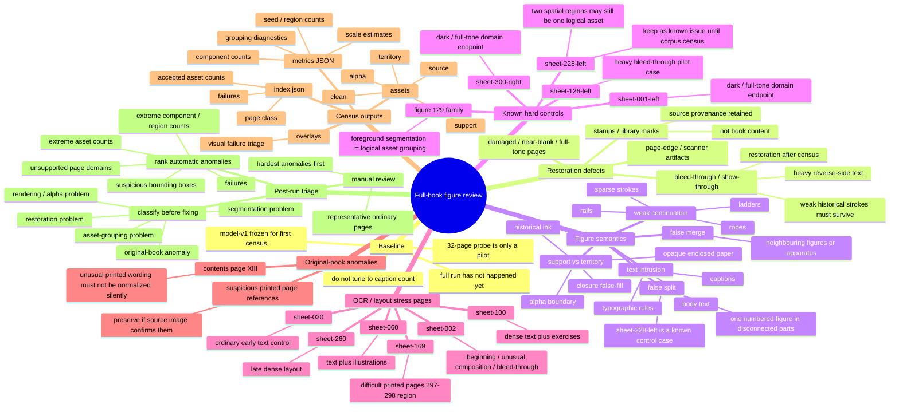

# Figure full-book review map v0

Status: living review map for `figures/model-v1`.

This document records the current review strategy and known hard cases before the first complete-book pass. It is deliberately a **census map**, not a calibration target: `model-v1` is frozen for the first full run so that fixes are driven by the frequency and shape of real failures across the corpus rather than by overfitting the 32-page pilot.

## Current strategy

```text
frozen model-v1
    ↓
all source pages in work/book-v1/pages
    ↓
figure-structure-full-v2
    ↓
index.json + per-page metrics + overlays + assets
    ↓
corpus-wide anomaly census
    ↓
classify failure families
    ↓
restore / repair by class
    ↓
rerun the same frozen model on repaired derivatives
    ↓
compare before/after
    ↓
only then revise model-v1 if a repeated segmentation class actually requires it
```

The first complete pass therefore precedes additional tuning. Severe bleed-through is treated primarily as a later restoration problem, not as something to hide inside segmentation thresholds.

## Full-book command

From the repository root on `figures/model-v1`:

```bash
./.venv-benchmark/bin/python tools/probe_figure_segmentation.py \
  work/book-v1/pages \
  --out work/figure-structure-full-v2
```

Equivalent command when the benchmark virtualenv is already activated:

```bash
python tools/probe_figure_segmentation.py \
  work/book-v1/pages \
  --out work/figure-structure-full-v2
```

No non-default model parameters should be added for the first census pass. The purpose is to measure the current committed baseline exactly as it stands.

## Mind map



## Known cases and how to treat them

### `sheet-228-left` — known logical grouping case

The page is intentionally **not** a pre-census tuning target. A single logical/numbered illustration can occupy two spatially separate regions. Two extracted components are therefore not automatically a segmentation failure; the relevant question is whether they should later be grouped as one archival asset.

Action for first full pass: record the output unchanged and compare it with similar cases found elsewhere in the book.

### `sheet-126-left` — heavy bleed-through

The pilot already showed that reverse-side fragments can become statistically unusual foreground. The current model can reject many of them at region level, but this page remains a restoration control.

Action for first full pass: preserve current segmentation result; do not compensate by globally raising thresholds. Later compare original → restored derivative → rerun.

### `sheet-001-left` and `sheet-300-right` — dark/full-tone page domain

These are useful controls for fail-closed page-domain classification. They should not be forced through ordinary body-text scale estimation.

### Figure 129 family — segmentation versus asset identity

This class establishes an architectural invariant: disconnected or weakly connected foreground evidence can still belong to one logical illustration. Pixel/support recovery and archival asset grouping remain separate evaluation layers.

## Review labels after the complete pass

Each suspicious page should receive one or more of these labels:

- `RESTORE_BLEED_THROUGH`
- `RESTORE_STAMP_OR_MARK`
- `RESTORE_PAGE_DAMAGE`
- `DOMAIN_UNSUPPORTED`
- `FIGURE_FALSE_SPLIT`
- `FIGURE_FALSE_MERGE`
- `FIGURE_MISSED_SUPPORT`
- `FIGURE_TEXT_INTRUSION`
- `FIGURE_FALSE_FILL`
- `FIGURE_ALPHA_BOUNDARY`
- `FIGURE_GROUPING_SEMANTIC`
- `ORIGINAL_BOOK_ANOMALY`
- `CONTROL_OK`

A page can carry several labels. In particular, restoration labels must not be collapsed into segmentation labels.

## What the first full pass is meant to answer

1. How many pages are outside the normal page domain?
2. How often does the baseline emit zero, one, two, or many assets?
3. Which false-split / false-merge patterns repeat often enough to deserve model changes?
4. Where does bleed-through become a restoration problem rather than an extraction problem?
5. Which apparent anomalies are actually faithful reproductions of the original book?
6. Which small set of defect families covers most of the corpus failures?

The important output is therefore not a single accuracy number. It is a corpus-wide taxonomy that tells us what should be restored, what should be regrouped semantically, and what—if anything—must actually change in `model-v1`.
