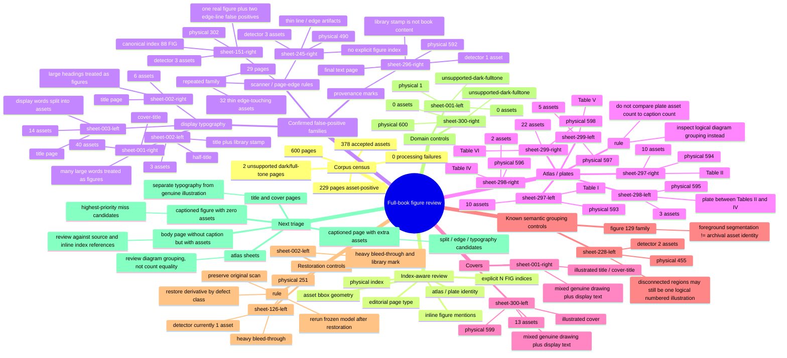

# Figure full-book review map v0

Status: living review map for `figures/model-v1`.

The first complete-book census has now been run. `model-v1` remains frozen while we classify the actual corpus-wide failure families. The goal is not to optimize against raw asset counts: page identity, physical index, editorial page type, explicit `N ФИГ.` indices, atlas/plate semantics and per-asset geometry all matter.

## First full-book census

Input: all 600 source pages in `work/book-v1/pages`.

Result:

- pages: **600**
- failures: **0**
- `normal-text-candidate`: **598**
- `unsupported-dark-fulltone`: **2**
- total accepted assets: **378**
- pages with at least one asset: **229**
- pages with 2+ assets: **41**
- pages with 3+ assets: **12**

Asset-count histogram:

```text
0: 371
1: 188
2: 29
3: 4
5: 1
6: 1
10: 2
13: 1
14: 1
22: 1
40: 1
```

The high-count tail is heterogeneous. It contains both obvious false positives from display typography and legitimate atlas/plate pages with many diagrams. Therefore raw count is only a triage signal.

## Current strategy

```text
frozen model-v1
    ↓
600-page complete census  ✅
    ↓
join detector output with editorial page/index metadata
    ↓
physical_index + page_type + explicit N ФИГ. indices
+ atlas/plate evidence + asset geometry
    ↓
rank suspicious pages by failure family
    ↓
manual/visual review of highest-value cases
    ↓
restore / repair by class
    ↓
rerun the same frozen model on repaired derivatives
    ↓
compare before/after
    ↓
only then revise model-v1 where repeated segmentation failures justify it
```

Severe bleed-through remains primarily a restoration problem. Title typography, scanner-edge rules and library stamps are separate false-positive families and must not be collapsed into one global threshold adjustment.

## Index-aware audit

Run:

```bash
python tools/audit_figure_census.py
```

The audit joins:

- `work/figure-structure-full-v2/index.json`;
- per-page `*.metrics.json`;
- `corpus/text/pages/*.json`.

It emits JSON, CSV and Markdown under:

```text
work/figure-structure-full-v2/census-audit/
```

The report records, per page:

- physical index;
- page id and editorial page type;
- explicit caption figure indices (`N ФИГ.`);
- all figure-number mentions;
- atlas/plate evidence;
- detected asset count;
- per-asset bbox and page-edge geometry;
- review flags and a triage score.

Caption count is evidence, not ground truth for logical asset count. A single numbered figure may consist of multiple disconnected regions, while an atlas plate may contain many diagrams without ordinary `N ФИГ.` captions.

## Mind map



## Repeated geometry family: scanner / page-edge rules

A corpus-wide bbox pass over the submitted metrics found **32** accepted assets on **29** pages that are simultaneously:

- within 1% of a page edge;
- very elongated (long/short side ratio >= 8);
- small in total page area (bbox <= 8% of page).

Visual contact-sheet review shows that this criterion is picking up the repeated red-boxed scanner/crop-edge strips seen on many ordinary text pages. It is a triage heuristic, not yet a deletion rule: a genuine rope/rail can also be long and thin, so canonical figure indices and source review still win.

Candidate pages, expressed as `physical_index : page_id`:

```text
 31 : sheet-016-left
 37 : sheet-019-left
 58 : sheet-029-right
 76 : sheet-038-right
120 : sheet-060-right
136 : sheet-068-right
139 : sheet-070-left
172 : sheet-086-right
190 : sheet-095-right
260 : sheet-130-right
302 : sheet-151-right   (2 candidate edge assets)
452 : sheet-226-right
463 : sheet-232-left
467 : sheet-234-left
490 : sheet-245-right
497 : sheet-249-left
520 : sheet-260-right
521 : sheet-261-left
539 : sheet-270-left
563 : sheet-282-left
567 : sheet-284-left
577 : sheet-289-left
578 : sheet-289-right
579 : sheet-290-left    (2 candidate edge assets)
580 : sheet-290-right
581 : sheet-291-left
583 : sheet-292-left
593 : sheet-297-left    (atlas; do not auto-delete)
597 : sheet-299-left    (atlas; 2 candidates; do not auto-delete)
```

This repeated family is important because some pages have **no other accepted asset**. If index review confirms no figure on such pages, those detections are direct false positives and provide a clean regression set for a future edge-artifact guard.

## Confirmed cases from the first census

### `sheet-151-right` — physical index 302, figure 88

Editorial text contains one explicit `88 ФИГ.` caption. The detector emits three assets. Visual overlay review shows the main figure is captured, while two long page-edge/scanner lines are also emitted.

Classification:

- `FIGURE_EDGE_ARTIFACT`
- `ASSET_COUNT_GT_CAPTION_INDEX`
- real figure preserved; two extra detections.

### `sheet-245-right` — physical index 490

Editorial text has no explicit figure caption on this page. The detector emits three small/thin assets, visually consistent with line/page-edge artifacts rather than illustrations.

Classification:

- `FIGURE_FALSE_POSITIVE`
- `FIGURE_EDGE_ARTIFACT`

### `sheet-296-right` — physical index 592

This is the last text page (`552`, ending with `КОНЕЦЪ.`). Editorial notes explicitly exclude the library stamp from body text. The detector emits one asset and the overlay shows that the selected region is the stamp.

Classification:

- `PROVENANCE_MARK_FALSE_POSITIVE`

### Front matter: `sheet-001-right`, `002-left`, `002-right`, `003-left`

These pages explain most of the extreme early counts. Large display words and decorated title typography are being interpreted as figure seeds/assets. Some pages also contain genuine illustrations or provenance marks, so the correct fix is page/asset semantic classification, not simply suppressing every large component.

### Atlas region: physical 593–598

The large tail counts around the end of the book are not directly comparable with ordinary figure-caption counts. Editorial metadata identifies these pages as tables/plates of technical drawings. They require logical diagram grouping review rather than ordinary caption-count equality.

## Review labels

A suspicious page may receive several labels:

- `RESTORE_BLEED_THROUGH`
- `RESTORE_STAMP_OR_MARK`
- `RESTORE_PAGE_DAMAGE`
- `DOMAIN_UNSUPPORTED`
- `FIGURE_FALSE_POSITIVE`
- `FIGURE_EDGE_ARTIFACT`
- `FIGURE_FALSE_SPLIT`
- `FIGURE_FALSE_MERGE`
- `FIGURE_MISSED_SUPPORT`
- `FIGURE_TEXT_INTRUSION`
- `FIGURE_FALSE_FILL`
- `FIGURE_ALPHA_BOUNDARY`
- `FIGURE_GROUPING_SEMANTIC`
- `ASSET_COUNT_GT_CAPTION_INDEX`
- `ASSET_COUNT_LT_CAPTION_INDEX`
- `PROVENANCE_MARK_FALSE_POSITIVE`
- `ATLAS_MULTI_DIAGRAM`
- `ORIGINAL_BOOK_ANOMALY`
- `CONTROL_OK`

## What we are measuring now

The next useful questions are:

1. Which pages contain an explicit `N ФИГ.` index but zero detected assets?
2. Where does one indexed figure produce several detector assets, and are the extras true disconnected parts or false positives?
3. Which body pages have uncaptioned assets, and do they correspond to inline figure references, apparatus drawings, stamps, page rules or noise?
4. Which atlas sheets are over-split or over-merged at the logical diagram level?
5. Which repeated defect families should be solved by restoration, and which actually require detector changes?

The target is a page/index-aware corpus map, not a single asset-count accuracy number.
