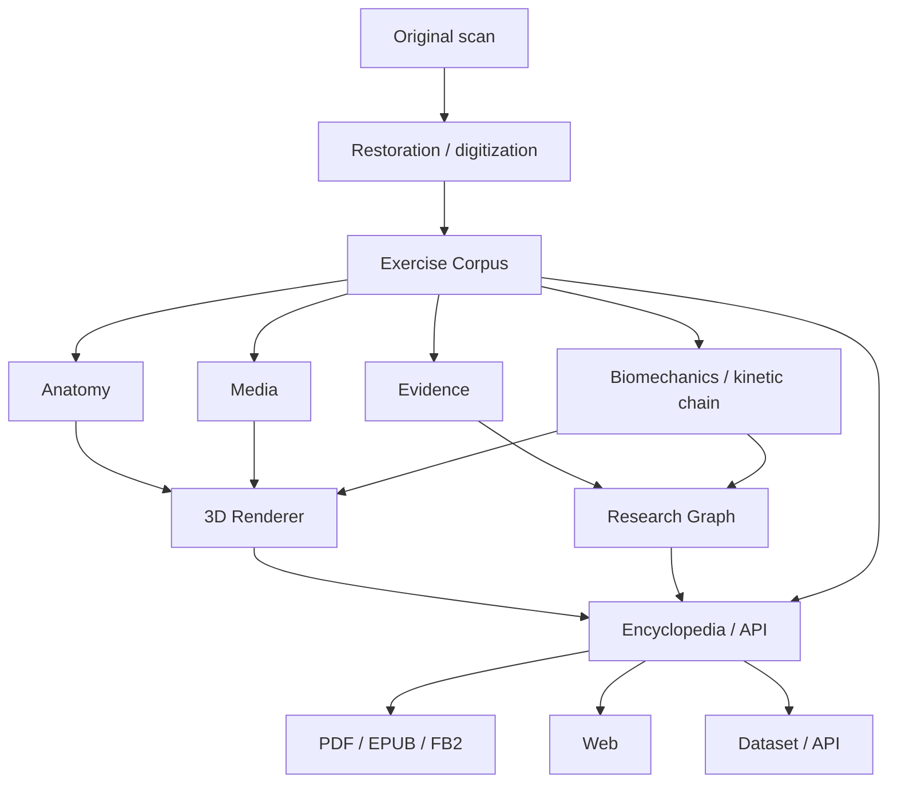

# Corpus Motuum — project mind map

This document freezes the project direction agreed at the beginning of the encyclopedia work. It is intentionally broader than the digitized-book releases: the historical book is source material for a versioned exercise knowledge system, not the final data model.

## Core principle

The system must always distinguish **what the historical source says** from **what Corpus Motuum infers, normalizes, models, or concludes**.

For every derived statement it must remain possible to answer, machine-unambiguously:

> Is this actually stated by the source, or is it a conclusion of our database?

PDF/EPUB/FB2/Web are renderings of the data. They are not the editorial source of truth.

## System map



The intended trace for a mature exercise record is:

```text
original page
  → restored text
  → normalized exercise
  → joint movements
  → muscles with canonical Latin names
  → tissues / structures under load
  → atomic scientific claims
  → supporting and contradicting studies
  → confidence / consensus
  → reproducible 3D anatomy renders
```

## Conceptual stages

The names below are **project stages**, not SemVer numbers. The current published `v1.0.x` and `v1.1.x` book editions belong to the restoration/digitization stage.

### Stage R0 — Restoration / Digitization Edition

No new substantive claims are added to the historical source.

- preserve source pagination and provenance;
- deskew / correct page geometry where necessary;
- remove scan dirt, bleed-through and obvious scanning artefacts conservatively;
- retain searchable text layers;
- verify OCR against the page image;
- do not redraw diagrams or figures without necessity;
- where a figure is physically damaged, preserve both the source evidence and the restored asset;
- preserve author, title, publisher, year, page identity and source hashes;
- identify the result as a restored/digitized edition, not a new authored edition.

Current book editions:

- `v1.0.x` — diplomatic / prereform text layer;
- `v1.1.x` — normalized-orthography text layer;
- both share the same canonical page order and figure identities.

### Stage R1 — Exercise Corpus

The book stops being the primary data model. Each exercise becomes a stable entity with a permanent ID.

Current ID namespace:

```text
EX-000001
EX-000002
...
```

IDs never change because a description, interpretation or scientific assessment changes.

Canonical `Exercise v1` top-level structure:

```text
Exercise
├── identity
├── source
├── names
├── description
├── execution
├── phases
├── equipment
├── body_position
├── movement
├── anatomy
├── biomechanics
├── kinetic_chain
├── evidence
├── risk_claims
├── variants
├── media
└── provenance
```

The historical and interpreted layers are explicitly separated, for example:

```yaml
source_text: >
  literal cleaned text of the historical source

normalized_description: >
  modern, unambiguous description of the exercise

editorial_notes:
  - what was interpreted, normalized or corrected
```

The first implementation target is **10–20 deliberately different exercises**, not the whole corpus. The pilot must include a simple movement, a complex multi-joint movement, an exercise with historical illustration(s), and an exercise with biomechanical/evidence ambiguity. Only after the complete vertical path survives these cases do we freeze `Exercise v1` and scale it to the whole book.

Vertical pilot:

```text
scan
  → clean source
  → structured Exercise v1 record
  → anatomy / biomechanics
  → evidence graph
  → four standardized 3D renders
```

### Stage R2 — Canonical anatomy layer

Exercises reference a separate canonical anatomy table instead of repeating free-text muscle names.

Canonical anatomy identifiers are based on official Latin anatomical terminology (FIPAT / Terminologia Anatomica), with language labels as aliases rather than primary identity.

Example:

```yaml
muscle:
  canonical_id: ...
  latin: musculus biceps brachii
  en: biceps brachii muscle
  ru: двуглавая мышца плеча
```

Exercise-to-anatomy relations are structured:

```yaml
role:
  - agonist
  - synergist
  - antagonist
  - stabilizer
  - dynamic_stabilizer

activation_class:
  - primary
  - secondary
  - minor

phase:
  - eccentric
  - concentric
  - isometric
```

A relation should be expressible at the level of:

```text
m. vastus lateralis — agonist — concentric — knee extension
```

rather than only “quadriceps works”.

### Stage R2b — Kinetic-chain and load graph

Kinematic structure is a graph, not a text tag.

Example chain:

```text
pelvis
  ↓
hip joint
  ↓
femur
  ↓
knee
  ↓
tibia
  ↓
ankle
  ↓
foot
  ↓
support surface
```

Represent, where applicable:

- joint actions and phases;
- open / closed kinetic chain;
- unilateral / bilateral;
- ipsilateral / contralateral;
- sagittal / frontal / transverse / multi-planar motion;
- axial loading;
- shear;
- compression;
- tension;
- torsion.

### Stage R3 — Evidence and research graph

The database does not issue unsupported verdicts such as “exercise X destroys the knee”. Each claim is atomic and separately linked to evidence.

Example shape:

```yaml
claim: Increased patellofemoral joint stress ...
population: ...
conditions:
  knee_flexion_angle: ...
  external_load: ...
  velocity: ...
outcome: ...
evidence_type: biomechanical_model | EMG | RCT | cohort | systematic_review
confidence: ...
sources:
  - DOI: ...
  - PMID: ...
```

Supporting evidence, contradicting evidence and limitations are preserved together. The goal is to represent the state of knowledge, not force a single final answer.

Claim classes:

- `FACT` — directly supported by strong sources;
- `SUPPORTED_INFERENCE` — not directly measured, but follows strongly from the data;
- `HYPOTHESIS` — plausible explanation requiring stronger evidence;
- `HISTORICAL_CLAIM` — claim made by the historical source, regardless of modern support.

EMG, adaptation, injury risk and force contribution are distinct concepts and must never be silently substituted for one another.

### Stage R4 — Reproducible 3D anatomy

Wolfram/AnatomyData may be used as an anatomical reference and secondary validator. Rendering is reproducible and automated, with Blender as the controllable renderer and anatomy assets licensed and attributed separately.

Pipeline:

```text
exercise.json
  ↓
anatomy resolver
  ↓
canonical structure IDs
  ↓
Blender scene
  ↓
materials / evidence view
  ↓
standard cameras
  ↓
4 PNG renders
```

Four camera views are standardized for the entire corpus:

- `VIEW_A` — front-right-superior;
- `VIEW_B` — front-left-inferior;
- `VIEW_C` — posterior-left-superior;
- `VIEW_D` — posterior-right-inferior.

Camera focal length, distance, elevation, azimuth, target and resolution are fixed so different exercises remain visually comparable.

Muscle highlighting represents **display category**, not fake physiological precision. A `visual_weight` can encode visual hierarchy for primary mover / secondary mover / stabilizer / antagonist, but real EMG measurements remain separate data with metric, protocol and source.

Views may eventually include:

- muscular participation;
- involved joints and axes / ROM;
- compression / shear / tension / torsion;
- structures referenced by evidence-backed risk claims.

Colour in a risk-evidence view represents evidence state or claim character, never a simplistic “danger” label.

### Later — simulation layer

OpenSim or another reproducible musculoskeletal simulation system may later add model-derived kinematics, moments, muscle forces and joint-reaction forces. Simulation output is explicitly labelled `simulation`, never experimental fact.

## Immediate implementation milestone

The next milestone is not “convert every page into cards”. It is to choose 10–20 maximally different exercises and complete the whole path:

```text
source page
→ Exercise v1
→ anatomy references
→ kinetic-chain graph
→ atomic evidence claims
→ provenance
→ four reproducible renders
```

Only after this pilot is internally coherent do we freeze the schemas and scale to the full exercise corpus.
